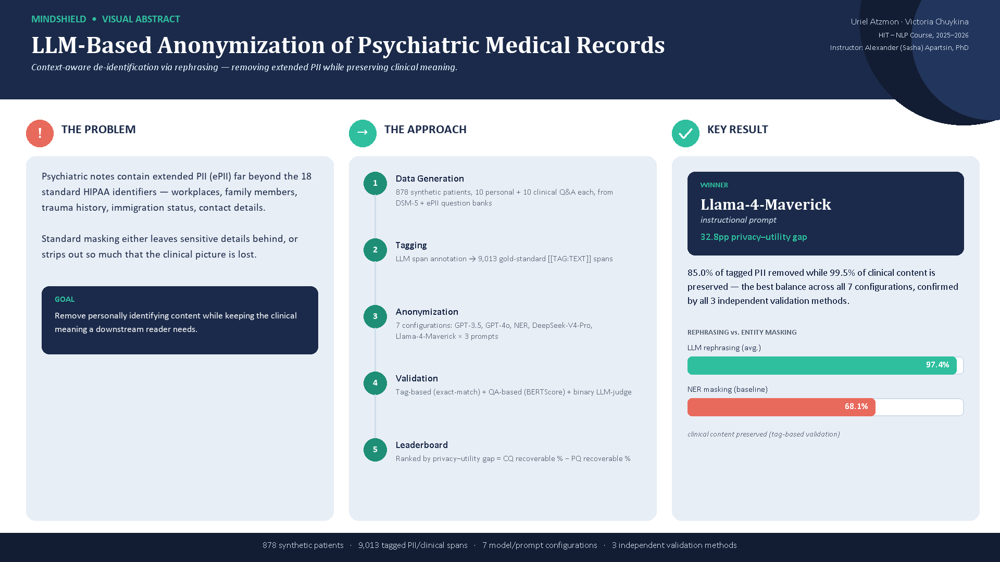
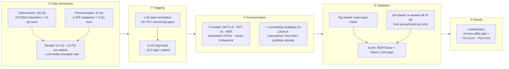

## 🧠 Introduction



Psychiatric clinical notes contain some of the most sensitive personal information in healthcare, including references to names, dates, locations, and detailed personal histories. Ensuring patient privacy while preserving the clinical value of such records is a critical challenge in the age of AI-powered health systems.

Large Language Models (LLMs) offer powerful capabilities for understanding and generating natural language, including potential applications in de-identification and clinical documentation. However, traditional anonymization tools often fail to handle the nuance and contextual complexity of psychiatric texts—either over-sanitizing (removing useful content) or missing sensitive identifiers.

**MindShield** is a benchmark and anonymization framework designed to tackle this problem. It leverages the power of LLMs to anonymize mental health records in a way that is both privacy-preserving and clinically meaningful. Specifically, MindShield combines:

- A synthetic dataset of annotated psychiatric notes
- A tag-based anonymization pipeline using LLM prompts
- A QA-based evaluation protocol to assess how well anonymized records preserve clinical meaning
- Metrics that quantify the trade-off between privacy protection and information retention

By simulating real-world mental health documentation, **MindShield** pushes LLMs beyond simple string substitution and toward **context-aware anonymization**.

🧩 **Project Goal**
The goal of MindShield is to develop and evaluate a robust anonymization pipeline for psychiatric records using LLMs — one that protects sensitive personal health information while preserving the clinical insights needed for downstream medical reasoning and AI tasks.

### 🔄 Pipeline Overview



**Input:** free text containing extended PII (ePII) — names, family, trauma, immigration, contact info — beyond the 18 standard HIPAA identifiers.
**Output:** rewritten note via context-aware rephrasing (not entity masking) — ePII removed, clinical meaning preserved.

## 🏆 Results

Seven anonymization configurations were validated on all 878 patients with three independent methods — tag-based exact-match, QA-based re-answering scored with BERTScore, and a binary LLM-judge on a 50-patient sample. All three agree on the winner:

| Model / prompt | Tag-based PII removed | Tag-based clinical preserved | LLM-judge PQ recoverable | LLM-judge CQ recoverable | Privacy–utility gap |
|---|---|---|---|---|---|
| **Llama-4-Maverick (instructional)** | **85.0%** | 99.5% | **5.2%** | 38.0% | **32.8pp** |
| Llama-4-Maverick (few-shot) | 80.6% | 96.0% | 6.4% | 37.9% | 31.5pp |
| GPT-3.5-turbo | 66.5% | 99.6% | 10.6% | 34.6% | 24.0pp |
| GPT-4o | 64.5% | 99.8% | 11.4% | 34.0% | 22.5pp |
| DeepSeek-V4-Pro | 73.3% | 99.9% | 14.0% | 33.7% | 19.6pp |
| Llama-4-Maverick (synthetic-identity) | 60.7% | 99.9% | 15.2% | 32.4% | 17.2pp |
| NER baseline | 53.5% | 68.1% | 15.6% | 29.0% | 13.4pp |

- **Rephrasing beats entity masking**: every LLM preserves far more clinical content than the NER baseline (95–99.9% vs. 68.1%), at comparable or better privacy.
- **Prompt engineering didn't beat the plain instruction**: neither few-shot examples nor a synthetic-identity rewrite outperformed the baseline instructional prompt on Llama-4-Maverick — synthetic-identity actually leaked *more* PII (60.7% vs. 85.0% removed).
- See [`Presentation/MindShield_Final_Report.pptx`](./Presentation/MindShield_Final_Report.pptx) for the full write-up, and `Data/qa_validation_summary.xlsx` / `Notebooks/Validation_QA_LLM_Victoria_Uriel.ipynb` for the underlying analysis.

### Known limitations

- **Dataset scale**: 878 synthetic patients, not the original 5,000-patient target — limited by generation API cost/time; disorder balance (68–106 patients per class) is preserved.
- **API error rows**: GPT-4o (119/878 rows) and DeepSeek-V4-Pro (~86/878 rows) hit transient Azure/OpenAI errors, excluded from that model's percentages. `gpt-5-mini` failed on 657/878 (75%) rows due to unresolved parameter-support errors and is excluded from all comparisons — left as future work.
- **BERTScore floor effect**: PQ/CQ BERTScore cluster tightly (0.886–0.911) regardless of real content overlap, since short answers score unexpectedly close to detailed ones under roberta-large embeddings — the binary LLM-judge is the more trustworthy metric for this reason.
- **LLM-judge sample size**: run on 50 patients per model (not all 878) for cost/time reasons; its CQ recoverable % (29–38%) likely reflects judge strictness on long clinical answers rather than a real utility weakness — tag-based clinical retention (95–99.9%) is the more reliable utility number.

## 🧾 Project Data

### 🔹 Overview

The MindShield dataset was synthetically generated to simulate realistic psychiatric records containing both **personal identifiers** and **clinical information**. It consists of structured prompts, annotated samples, anonymization outputs, and evaluation metadata — **878 synthetic patients across 10 DSM-5 disorders**.

---

### 🔹 Data Sources

#### 🧠 Clinical Questions (DSM-5 Guided)

A curated set of **100 clinical questions** (`Data/clinical_questions_dsm5.csv`) was developed based on **DSM-5 diagnostic criteria** — 10 questions each across 10 major psychiatric disorders (e.g., Major Depressive Disorder, Generalized Anxiety Disorder, PTSD, OCD, Schizophrenia). Example questions:

- *"Does the patient describe a persistent depressed mood?"*
- *"Has the patient lost interest or pleasure in usual activities?"*
- *"Does the patient report insomnia or hypersomnia?"*

These questions simulate clinician-style assessments and are re-asked against anonymized text to validate clinical content retention.

#### 🔐 Personal Questions (ePII Framework)

To simulate extended personally identifiable information (ePII), a structured set of **25 prompts** (`Data/personal_questions_epii.csv`) spans **5 categories**, 5 prompts each:

- Patient's Name
- Place of Residence
- Workplace or Occupation
- Family Members
- Education or Training

Example prompts include:

- *"Full Residential Address:"*
- *"Current Workplace:"*
- *"Have you experienced significant trauma? If so – what:"*

---

### 🔹 Record Construction

Each synthetic psychiatric note was built by:

1. **Sampling 10 personal questions** and generating realistic answers.
2. **Sampling 10 clinical questions** for a randomly chosen disorder, then simulating patient answers.
3. **Combining both** into a single therapist-style intake note (via LLM), then **tagging** every identifying/clinical span as `[[TAG:TEXT]]` (16+ tag types).

Each record carries the following fields (see `Data/generated_patient_data_anonymized.csv`):

| Field                         | Description                                              |
|-------------------------------|------------------------------------------------------------|
| `PQ_1`…`PQ_10` / `PA_1`…`PA_10` | Personal questions and ground-truth answers               |
| `CQ_1`…`CQ_10` / `CA_1`…`CA_10` | Clinical questions and ground-truth answers                |
| `Therapist_Note`              | Full synthetic note combining personal + clinical content |
| `Tagged_Note`                 | Note with gold-standard `[[TAG:TEXT]]` spans               |
| `Anonymized_<model>`          | One column per anonymization model / prompting strategy    |

---

### 🔹 Dual Annotation Strategy

Two tagging schemes are used:

- **PII tags**: for identifying names, dates, places, etc.
- **Clinical tags**: for preserving medically relevant statements (e.g., symptoms, diagnoses)

This dual tagging enables both:

✅ **Privacy validation**: measuring how well sensitive data was removed
✅ **Clinical fidelity evaluation**: testing whether key psychiatric information was preserved

---

The result is a rich benchmark for evaluating anonymization techniques under both privacy and utility constraints — tailored to the subtlety of psychiatric records.


## 🗂️ Project Structure

```bash
Anonymization-of-Mental-Health-Records/
├── Data/                                          # Source materials and generated datasets
│   ├── clinical_questions_dsm5.csv                # 100 DSM-5-based clinical questions
│   ├── personal_questions_epii.csv                # 25 ePII personal-identifier prompts
│   ├── generated_patient_data_final.csv           # Synthetic patients, pre-tagging
│   ├── generated_patient_data_with_notes.csv       # + therapist notes
│   ├── generated_patient_data_anonymized.csv       # + tags + all anonymization outputs
│   ├── qa_validation_results.csv.gz               # Full QA-based validation results (~123k rows, gzipped)
│   ├── qa_judge_sample_results.csv                # Binary LLM-judge verdicts (50-patient sample per model)
│   └── qa_validation_summary.xlsx                 # Summary workbook (model leaderboard, heatmap, etc.)
│
├── Notebooks/                                     # Core notebook-based pipeline
│   ├── DATA_LLM_Victoria_Uriel.ipynb              # Data construction: building full synthetic records
│   ├── Anonymization_LLM_Victoria_Uriel.ipynb     # Anonymization: 5 models + 3 prompting strategies
│   ├── EDA_LLM_Victoria_Uriel.ipynb                # Exploratory data analysis
│   └── Validation_QA_LLM_Victoria_Uriel.ipynb      # QA-based validation (BERTScore + LLM-judge)
│
├── Presentation/                                  # Slide decks / reports
│   ├── MindShield_Visual_Abstract.png             # One-page infographic: problem, approach, key result
│   ├── MindShield_Proposal.pdf                    # Original project proposal
│   ├── MindShield_Interim_Report.pptx             # Interim report deck
│   └── MindShield_Final_Report.pptx               # Final report deck (final validated results)
│
├── .env.example                                   # Template for required API keys (copy to .env)
├── requirements.txt                               # Environment dependencies
└── README.md                                      # Project overview and documentation
```

## 🚀 Quick Start

Follow these steps to set up and run the **MindShield** anonymization pipeline locally.

### 1. Clone the repository

```bash
git clone https://github.com/UriAtzmon/Anonymization-of-Mental-Health-Records.git
cd Anonymization-of-Mental-Health-Records
```

### 2. Install dependencies

It's recommended to use a virtual environment. Then install the required packages:

```bash
pip install -r requirements.txt
```

### 3. Set up API keys

Copy `.env.example` to `.env` and fill in your own keys — **never commit `.env`, it's already git-ignored**:

```bash
cp .env.example .env
```

```
OPENAI_API_KEY=...              # for GPT-3.5 / GPT-4o cells
AZURE_KEY_URIEL_EASTUS2=...      # for the Azure AI Foundry models (Phi-4-class endpoint)
```

### 4. Run the notebooks, in order

1. `Notebooks/DATA_LLM_Victoria_Uriel.ipynb` — generates synthetic psychiatric records from structured clinical and personal prompts.
2. `Notebooks/Anonymization_LLM_Victoria_Uriel.ipynb` — runs the anonymization pipeline across all models and prompting strategies.
3. `Notebooks/EDA_LLM_Victoria_Uriel.ipynb` — exploratory analysis of the generated dataset.
4. `Notebooks/Validation_QA_LLM_Victoria_Uriel.ipynb` — QA-based validation (re-answers all 20 questions from the anonymized text and scores with BERTScore + an LLM judge). This is the longest-running notebook (~3–5 hours for the full dataset across all models) — it checkpoints after every answer, so it can be safely interrupted and resumed.

## 🔭 Future Directions

MindShield lays the groundwork for LLM-based anonymization in mental health. Concretely on the roadmap (see [Known limitations](#known-limitations) above for what's already been diagnosed):

- Scale the synthetic dataset toward the original 5,000-patient target (currently 878)
- Fix `gpt-5-mini`'s parameter-support errors and re-validate it alongside the other 7 configurations
- Run the LLM-judge on the full 878-patient set rather than a 50-patient sample
- Fine-tune a smaller model on the synthetic dataset for a cheaper, self-hosted anonymizer
- Support multilingual records
- Integrate human expert (clinician) review of anonymization quality
- Test anonymized data on downstream clinical NLP tasks

We welcome contributions and extensions!

## 👥 Developers

**MindShield** was developed as part of an academic project (Natural Language Processing, HIT) exploring LLM-based anonymization in mental health records, under the guidance of **Alexander (Sasha) Apartsin, PhD**.

Built with care and curiosity by:

- **Victoria Chuykina**
- **Uriel Atzmon**

Years: 2025–2026

---

*For feedback, questions, or collaborations — feel free to reach out!*
